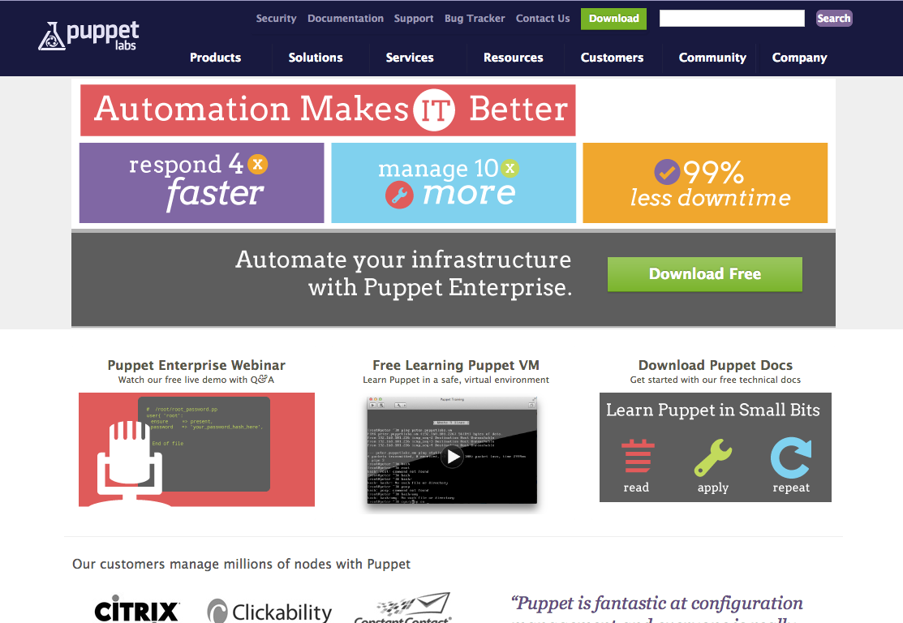

## 第1章 なぜPuppetが必要なのか？

[Puppet](https://puppetlabs.com/)は、サーバの構成管理を自動化するためのフレームワークです。2005年のリリース以来、[Chef](http://www.opscode.com/chef/)と並んで、その分野におけるスタンダードなフレームワークとして、広く使われています。

### なぜPuppetが必要なのか

Puppetのようなフレームワークを使わずに構成管理をする場合、主に採られる手法として、以下のふたつが挙げられるでしょう。

  * 手順書による管理
  * スクリプトによる自動化

いずれの手法であっても、サーバの構築当初には十分に機能するでしょう。しかし、システムのあるべき姿は、現在のような変化の激しい時代には、どんどん移り変わっていきます。手順書やスクリプトによる構築では、そのような変化に十分に対応することができません。

変化に柔軟、かつ、継続的に対応するために、Puppetのような構成管理専用のフレームワークが必要とされるのです。

### 手順書の問題点

手順書による構成管理の問題点として、以下が挙げられます。

  1. 手作業による時間のロス
  2. オペレーションミスの発生可能性
  3. 時間の経過にともなう手順の変更が、往々にして手順書に反映されないことによる作業漏れ

手順書という、コンピュータによる実行が不可能な手段に頼って構成管理をする以上、上記のような問題から逃がれることはできません。手順書を捨て、本書を参考にして、すぐにでもPuppetを使い始めましょう。

### スクリプトの問題点

スクリプトによる構成管理の問題点として、以下が挙げられます。

  1. 書くひとによってスクリプトの品質にバラつきが出る
  2. よほど注意して書かない限り、すぐにスクリプトが肥大化し破綻する。そもそもシェルスクリプト自体の保守性に問題がある
  3. 構成内容に変化があった場合、これまでの状態を保ちつつ変更を加えることが難しい

コンピュータによって実行が可能という意味で、スクリプトによる構成管理は、手順書によるそれに比べるといくぶんかマシではあります。ただ、それでも上記のような問題点はつきまとってきます。ここでは特に、3番目について見ていきましょう。

### 冪等性

Puppetのような構成管理フレームワークの肝となる考え方に「冪等性」というものがあります。これは、構築手順を何度実行しても、そのたびにシステムが同じ状態に構築されるということを意味します。このことは、構成管理において、非常に重要です。

前述の通り変化の激しい現在、スクリプトでやるにせよPuppetを使うにせよ、同じ内容の手順を何度も実行することになります。スクリプトで構成管理をしていると、たとえば「あるファイルがなかったら作成する、あったら何もしない」という操作を記述するのに、いちいちファイルの存在確認を行う条件分岐を、そのたびごとに何度も書かなければなりません。

Puppetが提供するresource type(後述)のほとんどは、あらかじめ冪等性を担保することが前提に作られているので、そのようなことに気を揉むことなく、常に安全に実行できます。構成管理において冪等性を担保することが、Puppetのようなフレームワークの本質です。

### manifest

Puppetの世界では、これからみなさんが書いていく設定ファイルのことを"manifest"と呼びます。正確には「設定ファイル」というよりは「システムのあるべき状態を記述したもの」というべきものです。そのmanifestを、Puppet独自の宣言的言語を使って書いていきます。

なぜXMLやYAMLなどの設定ファイルによく用いられるようなフォーマットや、あるいは、Rubyのようなプログラミング言語を使わないのでしょうか。マニフェストは、先に述べたように「システムのあるべき状態」を記述するためのものなので、XMLやYAMLのような汎用データ記述フォーマットも、Rubyのような汎用プログラミング言語も、その役を果たすにはあまりにも一般的に過ぎるから、という判断によるようです。

### Chefとの比較

昨今、Puppetと並んでよく使われているChefの人気が高まっています。後発だけあって、比較的洗練されている感じもしますし、周辺ツールの開発も活発なようです。本書ではPuppetについて解説しますが、筆者としては正直なところ、PuppetでもChefでも、構成管理がしっかりできさえすれば、使うのはどちらでもかまわないと考えます。

Chefは、Rubyによるいわゆる内部DSLによってレシピを書くという仕様により、記述の自由度が高いというイメージを持たれているようです。ただし、以下の表の通り、ディレクトリ構成はPuppetに比べて厳格です。Puppetでは、後述していく通り、ディレクトリ構成のベストプラクティスはあるものの、実際にはほとんど制限がありません。

|        | 言語          | ディレクトリ構成 |
| ------ |:------------:|:--------------:|
| Puppet | 外部DSL       | 比較的自由      |
| Chef   | 内部DSL(Ruby) | 決まっている    |

このように、ひとくちに「自由度」といってもどこを見るかによって違ってきます。また、自由度が高いということは、うまくハンドリングできなかった場合、それだけ「カオス」を招く結果に陥りやすいということでもあります。読者のおかれた環境により適したフレームワークを選ぶのがよいでしょう。どちらを選んでも、結果としてやれることは同じです。

### Puppetの言語

PuppetはChefとは異なり、manifestの記述に独自の宣言的言語を用いると述べました。とはいえ、基本的な記述を行う分には、その文法は非常にシンプルで、特に難しいところはなにもありません。むしろ、Rubyが得意ではないひとからしたら、Puppetの言語の方が圧倒的に簡単でしょう。

本書は、manifestを書きシステムに適用しながら、最初の一歩からより実践的な設定まで、手を動かしながら学んでいくというスタイルを採っています。本書を読み進め、手を動かしているうちに、どのように書けばいいのか、自然におぼえてしまっていることでしょう。

### まとめ

本章では、Puppetとは何か、なぜそれが必要なのかについて見ていきました。その理由として「変化に対応するため」ということを明らかにしました。また、それを可能にするのが「冪等性」という性質でした。「冪等性」については、本書を通じて何度も言及されることでしょう。それだけ大切だということです。

絶えまない変化に対応していくためにこそ、Puppetのようなフレームワークが必要とされるのです。
