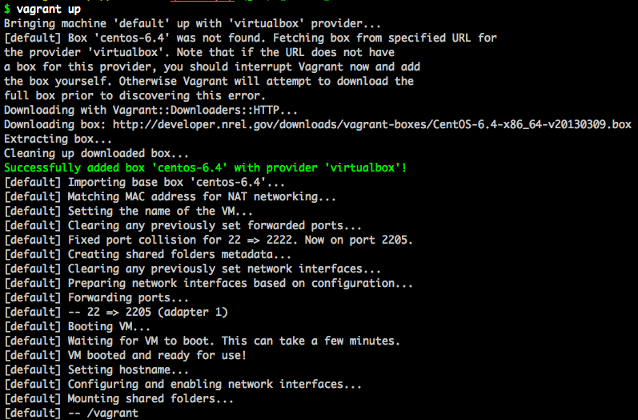

## 第2章: Vagrantで試験環境を用意する

本書では、「はじめに」で述べたように、Puppetの試験環境としてLinux(Amazon LinuxとCentOS)を使用します。といっても、いますぐ手元に、自分の自由になるLinux環境を用意できないという読者も多いでしょう。

そこで、Puppetの実践に入る前に、まずはVagrantというツールを使って、試験環境を用意してみましょう。

### Vagrantとは？

[Vagrant](http://www.vagrantup.com/)は、[VirtualBox](https://www.virtualbox.org/)や[VMware](http://www.vmware.com/)、[Amazon EC2](http://aws.amazon.com/ec2/)といった仮想化ツールを、簡単にコントロールするためのラッパツールです。元々はVirtualBox専用に開発されたものでしたが、本書で使用するバージョン1.1以降は、[Providersという仕組み](http://docs.vagrantup.com/v2/providers/)を導入したことで、プラグインによってVirtulaBox以外の仮想化ツールにも対応するようになりました。

本書では、これまでVagrantでの利用実績が豊富なVirtualBoxを使っていくことにします。

### Vagrantのインストール

まずはVirtualBoxをインストールしましょう。[VirtualBoxのダウンロードページ](https://www.virtualbox.org/wiki/Downloads)からお使いの環境にあったパッケージをダウンロードし、インストーラの指示に従ってインストールしてください。

VirtualBoxのインストールが終わったら、今度はVagrantをインストールします。[Vagrantのダウンロードページ](http://downloads.vagrantup.com/)からお使いの環境にあったパッケージをダウンロードしてください。その際、本書の環境と合わせるため、1.1.0以上のバージョンをダウンロードするようにしてください。その後、インストーラの指示に従ってインストールします。

### 仮想ホストの起動

Vagrantで利用できる仮想ホストのひな形は、有志により様々なディストリビューションのものが提供されています([http://www.vagrantbox.es/](http://www.vagrantbox.es/))。ここでは、CentOS 6.4のものを利用します。

仮想ホストを起動するための設定は非常に簡単です。適当なディレクトリ内で、以下の内容のファイルを`Vagrantfile`という名前で作成してください。

```ruby
Vagrant::Config.run do |config|
  config.vm.box       = "centos-6.4"
  config.vm.box_url   = "http://developer.nrel.gov/downloads/vagrant-boxes/CentOS-6.4-x86_64-v20130309.box"
  config.vm.host_name = "puppet.book.local"
end
```

ファイルを作成したのと同じディレクトリで、以下のコマンドを実行すると、仮想ホストが起動します。

```
$ vagrant up
```



以下、本書の説明を通じて、`vagrant`コマンドは、`Vagrantfile`のあるディレクトリで実行してください。

初回実行時には、仮想ホストのひな形(boxといいます)をダウンロードするために時間がかかりますが、次回からは既にダウンロードしたboxを使用するため、すぐに起動します。

### 仮想ホストにSSHログインする

以下のコマンドを実行すると、仮想ホストにSSHでログインできます。

```
$ vagrant ssh
```

また、のちの章では通常のsshコマンドによるログインが必要になりますので、以下のようにコマンドを実行して、準備しておいてください。

```
$ vagrant ssh-config --host puppet-book.local >> ~/.ssh/config
```

これで、いつものようにsshコマンドで仮想ホスト(ここではpuppet-book.localというホスト名を指定)にログインできます。

```
$ ssh puppet-book.local
```

ログインしたら、適当にコマンドを実行してみたりして、触ってみてください。ふだん使っているLinuxと変わらない環境が簡単にできてしまったことに、驚くことでしょう。

また、あれこれといじってみた結果、たとえ壊してしまったとしても、後述の通り簡単にリセットして元通りにできますので、安心です。

### 仮想ホストの停止・破棄

仮想ホストを停止するには`halt`サブコマンドを、破棄(リセット)するには`destroy`サブコマンドを使います。

```
$ vagrant halt
```

を実行すると一時停止、

```
$ vagrant destroy
```

で破棄(リセット)されます。再度、仮想ホストを起動したい場合は、最初と同じく

```
$ vagrant up
```

を実行してください。

Vagrantには、上記で紹介したものの他にもたくさんの便利なサブコマンドがありますが、本書の範囲内では、以上で十分です。より詳しく知りたい方は、[Vagrantのドキュメント](http://docs.vagrantup.com/v2/cli/)を参照するとよいでしょう。

### まとめ

本章では、Puppetを実際に使う前段階として、Vagrantを使ってPuppetの試験環境を用意しました。`vagrant up`で起動し、あれこれいじった後に気に入らなくなってきたら`vagrant destroy`で元通りなんてことも、簡単にできてしまいます。これからPuppetでこの仮想ホストをいじり倒していくには、もってこいの機能です。

ちなみに、VagrantにはPuppetと連携できる機能があり、`vagrant up`時に、指定した設定をもとにPuppetを実行することもできます。その件については、後述することにしましょう。
